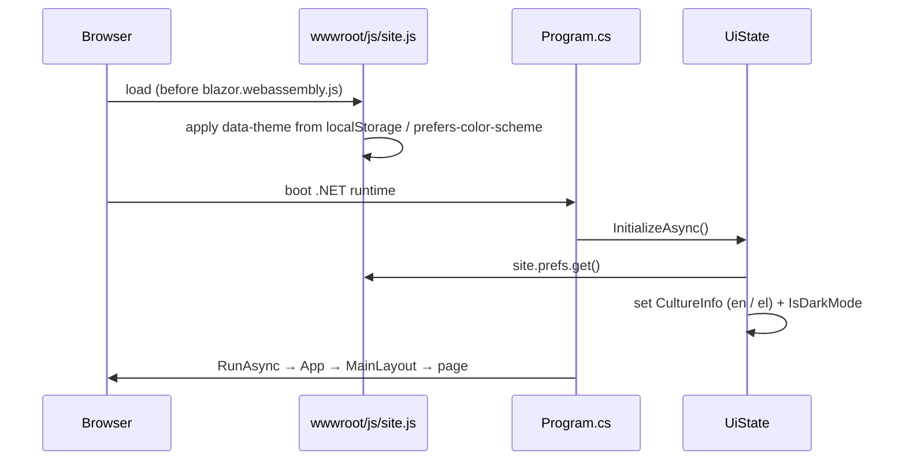
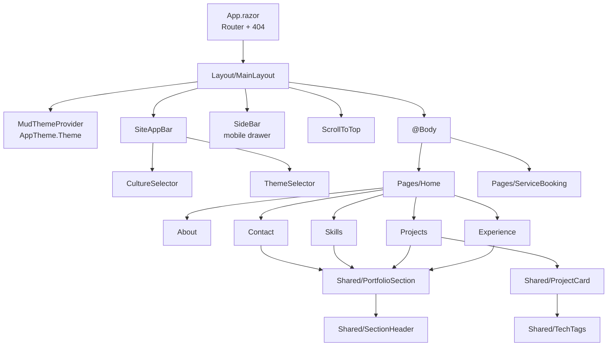

# Architecture

PersonalWebSite is a client-side single-page application: a **Blazor WebAssembly** app (.NET 10) compiled to static files and served by **Azure Static Web Apps**. There is no backend. All content ships with the app (resx strings, `appsettings.json` links, images).

## Startup

The culture and theme are resolved **before the first render**, so the page never flashes the wrong language or theme. Changing the language writes `BlazorCulture` and reloads the page.

## Component tree

## Building blocks
| Concern | Where | Notes |
|---|---|---|
| Content catalog | `Data/PortfolioContent.cs`, `Models/PortfolioModels.cs` | Jobs, projects, skills, nav items, social links as records. Sections loop over these. |
| Skill icons | `Data/SkillIcons.cs` | Inline SVG markup used by skill chips and the skill snackbar. |
| Text | `Resources/Localize.Resource{,.en,.el}.resx` | Accessed via `IStringLocalizer<Resource>`, injected globally as `L` in `_Imports.razor`. `L.Html(key)` renders values that contain HTML. |
| Links / email | `wwwroot/appsettings.json` | Read through `IConfiguration` (`Config["JobLinks:PwC"]`). |
| Theme | `Theme/AppTheme.cs` | One `MudTheme`: light (teal) and dark (blue-grey) palettes, burlywood `Tertiary` accent, fluid `clamp()` typography, 12px radius. |
| Global CSS | `wwwroot/css/app.css` | `--app-*` tokens, then sections for layout, components, pages, motion, and the loading/error UI. Colors come from `var(--mud-palette-*)`. |
| UI state | `SharedState/UiState.cs` (singleton) | `IsDarkMode`, `IsDrawerOpen`, culture toggle, `GoHomeAsync`. Raises `Changed`; subscribers unsubscribe in `Dispose`. |
| JS interop | `wwwroot/js/site.js` → `window.site` | Preferences in localStorage, hide-on-scroll app bar, scroll-reveal (`.reveal` → `.is-visible`), scrollspy (`aria-current` on `[data-nav-target]`), `scrollToHash`, `scrollToTop`. A MutationObserver re-syncs the IntersectionObservers at most once per frame and unobserves nodes Blazor removed. |

## Responsive strategy
- Typography scales through `clamp()` in the theme. Components use fixed `Typo` values.
- Layout uses `MudGrid` breakpoints and CSS grid/flex. `MudHidden` is used only where widgets genuinely differ: the app bar (burger vs inline nav) and Experience (tabs on phones, timeline elsewhere). Both Experience branches render the same `Jobs` data through one `JobDetails` template.

## Motion and accessibility
- `.reveal` elements fade up when they scroll into view. The hidden state applies only after `site.js` adds `html.js-reveal`, so content stays visible if JS fails or the user prefers reduced motion. Skill chips play their animate.css keyframe (`Skill.Animation`) when revealed.
- `prefers-reduced-motion` disables animations and smooth scrolling.
- Icon-only buttons have localized `aria-label`s (`Aria*` resx keys). Sections are `<section id>` landmarks with `scroll-margin-top` for the fixed app bar. There is one `h1` (the name in the hero).

## Routing
- `/`: Home. Nav links are `/#section` (`jobs`, `projects`, `skills`, `contact`). From other pages they navigate home, and `Home` calls `site.scrollToHash()` after its first render.
- `/ServiceBooking`: system-design diagrams for the Service Booking project.
- Anything else renders the styled 404 in `App.razor`. In production, `wwwroot/staticwebapp.config.json` rewrites unknown paths to `index.html`.

## Build and deploy
- `PersonalWebSite.csproj` sets `TreatWarningsAsErrors`. MudBlazor's analyzer (`MUD0002`) flags invalid component parameters.
- `.github/workflows/ci.yml` builds every PR (`-warnaserror`).
- `.github/workflows/azure-static-web-apps-*.yml` builds with Oryx and deploys `wwwroot` output to Azure Static Web Apps on pushes to `main`, plus preview environments for PRs.

## Dependencies
| Package | Why |
|---|---|
| `Microsoft.AspNetCore.Components.WebAssembly` | Blazor WASM runtime |
| `MudBlazor` 9.x | Components, theming, breakpoints, snackbar |
| animate.css (CDN) | Keyframes used by skill chips, card flip, pulses |
| Roboto (Google Fonts) | Typeface |

Decisions behind these choices are recorded in [docs/decisions/](docs/decisions/).
